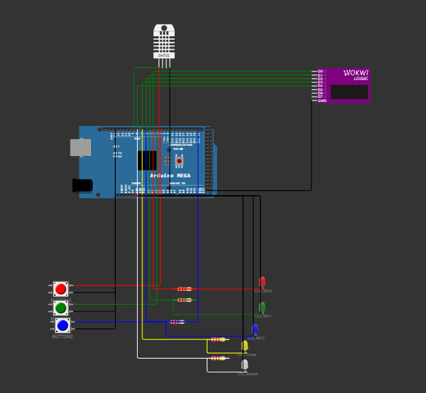
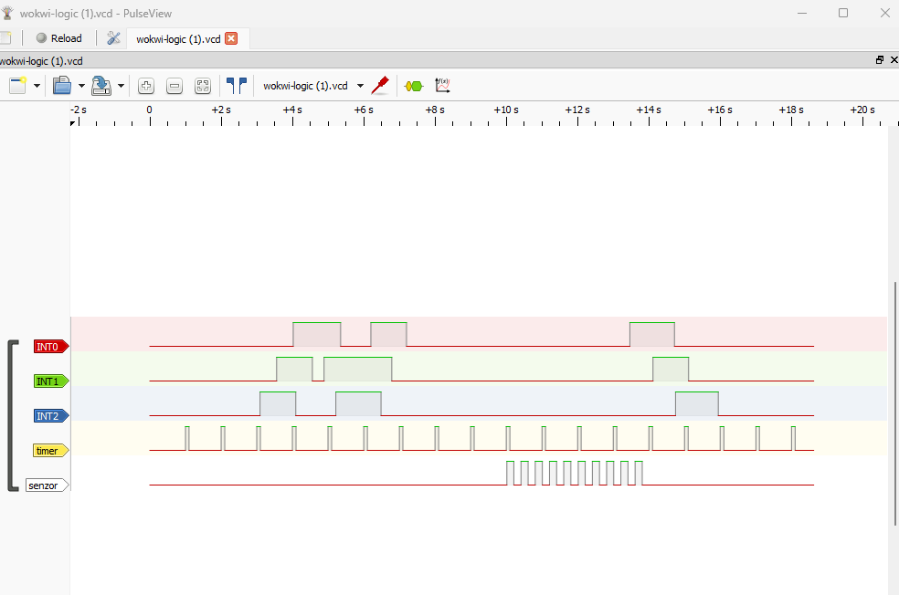

# Sustav s Prekidima za Arduino

## 1. Opis Sustava
Ovaj projekt implementira sustav koji koristi prekide za obradu ulaznih signala s tipkala i senzora temperature (DHT22) te generira vizualne indikacije pomoću LED dioda.

## 2. Funkcionalnosti

### 2.1. Rukovanje prekidima tipkala
| Tipkalo  | Prioritet | Prekid  | Akcija |
|----------|----------|---------|--------|
| BUTTON0  | Visoki   | INT0    | LED_INT0 titra 1 sekundu |
| BUTTON1  | Srednji  | INT1    | LED_INT1 titra 1 sekundu |
| BUTTON2  | Niski    | INT2    | LED_INT2 titra 1 sekundu |

- Implementiran debounce mehanizam za sprečavanje višestrukih aktivacija.

### 2.2. Rukovanje prekidom tajmera
| Tajmer   | Prekid  | Akcija |
|----------|--------|--------|
| TIMER1   | Svake 1s | LED_Timer svijetli kratko |

### 2.3. Rukovanje senzorom temperature (DHT22)
| Senzor  | Prag | Akcija |
|---------|------|--------|
| DHT22   | < 25°C | LED_Temp titra svakih 200ms |

- Provjera temperature svakih 2 sekunde.

### 2.4. Izvršavanje prioriteta prekida
| Prioritet | Prekid  |
|-----------|---------|
| 1 (Najviši) | TIMER1 |
| 2 | INT0 (BUTTON0) |
| 3 | INT1 (BUTTON1) |
| 4 | INT2 (BUTTON2) |
| 5 (Najniži) | Senzor temperature |

- Implementacija koristi neblokirajuće metode (`millis()`) umjesto `delay()`.

## 3. Spajanje komponenti
| Komponenta   | Arduino Pin |
|-------------|------------|
| BUTTON0     | 2 (INT0) |
| BUTTON1     | 3 (INT1) |
| BUTTON2     | 21 (INT2 - samo na Mega) |
| LED_INT0    | 4 |
| LED_INT1    | 5 |
| LED_INT2    | 6 |
| LED_TIMER   | 7 |
| LED_TEMP    | 8 |
| DHT22       | 9 |

- Tipkala su povezana s odgovarajućim `INT` pinovima.
- LED diode signaliziraju aktivaciju prekida.
- Senzor temperature (DHT22) je spojen na digitalni pin 9.

## 3.1 Shema spajanja




## 4. Simulacija i Testiranje
- Sustav je testiran u **Wokwi** simulatoru.
- Logički analizator je korišten za provjeru prioriteta prekida.
- Nakon zaustavljanje simulacija preuzima se .vcd datoteka sa prikazima prekida 



## 5. Zaključak
Ovaj sustav demonstrira korištenje prekida u realnom vremenu, s optimiziranim performansama kroz neblokirajuće metode i pravilno definirane prioritete.

## Otvaranje VCD datoteke
1. Preuzeti PulseView
2. Otvoriti preuzetu VCD datoteku i postaviti Downsampling faktor

## Postavljanje Wokwi simulatora

Za pokretanje ovog projekta u Wokwi simulatoru:

1. Stvorite novi Arduino projekt u Wokwi simulatoru
2. Kopirajte priloženi diagram.json u projekt
3. Kopirajte priloženi Arduino kod u sketch.ino
4. Stvorite datoteku `libraries.txt` sa sljedećim sadržajem:

```
DHT sensor library
```
