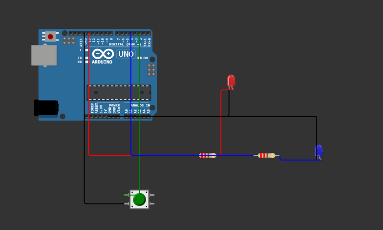

# README: Arduino Sleep Mode Sustav za Štednju Energije

## 1. Opis Sustava
Ovaj projekt implementira sustav za optimizaciju potrošnje energije Arduino mikrokontrolera korištenjem različitih sleep modova. Sustav omogućuje Arduino uređaju da većinu vremena provodi u niskopotrošnom režimu, a aktivira se samo kad je potrebno ili kada je probuđen vanjskim signalom.

## 2. Funkcionalnosti

### 2.1. Rukovanje sleep modovima
| Mode | Potrošnja | Karakteristike |
|------|-----------|----------------|
| SLEEP_MODE_PWR_DOWN | Najniža (~0.1μA) | Sve periferije isključene |
| SLEEP_MODE_PWR_SAVE | Niska (~1μA) | Samo Timer2 aktivan |
| SLEEP_MODE_STANDBY | Vrlo niska (~0.8μA) | Glavni oscilator radi |
| SLEEP_MODE_IDLE | Viša (~4-15mA) | CPU zaustavljen, većina periferija aktivna |

* Implementirana mogućnost promjene sleep moda pritiskom tipkala

### 2.2. Mehanizmi buđenja
| Mehanizam | Prekid | Akcija |
|-----------|--------|--------|
| Tipkalo | Vanjski prekid (INT0) | Buđenje i trepćuća LED |
| Watchdog timer | WDT_vect | Automatsko buđenje nakon 8 sekundi |

* Implementiran debounce mehanizam za tipkalo kroz prekidnu rutinu

### 2.3. Optimizacija potrošnje
| Periferija | Upravljanje |
|------------|-------------|
| ADC | Isključen tijekom sleep moda |
| SPI | Isključen tijekom sleep moda |
| TWI/I2C | Isključen tijekom sleep moda |
| Timer0 | Isključen u svim modovima osim IDLE |
| USART | Isključen u svim modovima osim IDLE |
| BOD | Isključen samo za PWR_DOWN i STANDBY modove |

* Korištenje F() makroa za smještanje stringova u flash memoriju umjesto RAM-a

## 3. Spajanje komponenti
| Komponenta | Arduino Pin |
|------------|-------------|
| LED | 13 (built-in) |
| Tipkalo | 2 (INT0) |
| GND | GND |

* Tipkalo je povezano s pull-up otpornikom na pin 2
* LED dioda signalizira aktivni period uređaja
* Serijski monitor (9600 baud) koristi se za prikaz informacija

### 3.1 Shema spajanja



## 4. Ciklus rada programa
1. Aktivni period (LED uključena) - trajanje 5 sekundi
2. Priprema za sleep mode (isključivanje nekorištenih periferija)
3. Konfiguracija watchdog timera (8 sekundi)
4. Ulazak u odabrani sleep mode
5. Buđenje:
   - Tipkalom - trenutačno buđenje, opcija promjene moda
   - Watchdog timerom - automatsko buđenje nakon 8 sekundi
6. Povratak na aktivni period

## 5. Simulacija i Testiranje
* Sustav je testiran na Arduino UNO platformi
* Potrošnja je izmjerena multimetrom u seriji s napajanjem
* Vizualna indikacija LED diodom olakšava praćenje ciklusa rada

### 5.1 Rezultati mjerenja potrošnje


## 6. Postavljanje projekta
Za pokretanje ovog projekta:
1. Spojite komponente prema shemi
2. Učitajte kod na Arduino
3. Otvorite serijski monitor (9600 baud) za praćenje rada

```
// libraries.txt
avr/sleep.h
avr/power.h
avr/wdt.h
```

novima
